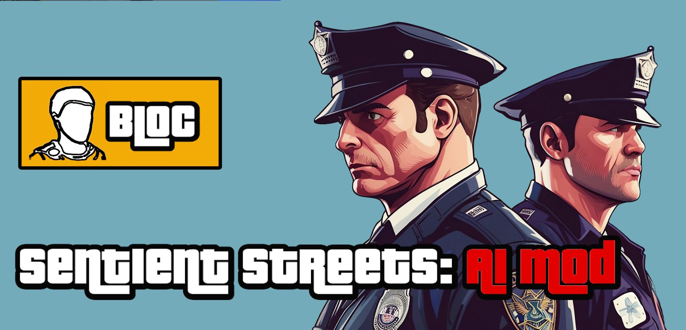

# Sentient Streets: AI Story Mode Source Code

### [See the Demo Video](https://youtu.be/cu4g743ONoo)

## Ready-to-Play Version
Mod is already released and can be downloaded and played. If you are not interested in source code, please visit
https://www.nexusmods.com/gta5/mods/672
and 
https://gtainworldmod.netlify.app/
to start playing with the mod.

## Requirements

1. [Visual Studio 2022](https://visualstudio.microsoft.com/)
1. [.NET Framework 4.8 Developer Pack](https://dotnet.microsoft.com/en-us/download/visual-studio-sdks?cid=getdotnetsdk)
1. [NuGet Package Manager CLI](https://www.nuget.org/downloads)
1. [scripthookv pre-built version](http://www.dev-c.com/gtav/scripthookv/)
1. [scripthookvdotnet pre-built release version](https://github.com/scripthookvdotnet/scripthookvdotnet/releases)
1. Make sure you downloaded the mod soundtracks from mod source. 

## Mod Setup

1. Install [Visual Studio](https://visualstudio.microsoft.com/) and then the [.NET 4.8 DP](https://dotnet.microsoft.com/en-us/download/visual-studio-sdks?cid=getdotnetsdk)
1. Download the latest [NuGet CLI exe](https://www.nuget.org/downloads) and add the folder it's contained in to the [Windows Environment Variables](https://docs.oracle.com/en/database/oracle/machine-learning/oml4r/1.5.1/oread/creating-and-modifying-environment-variables-on-windows.html) `Path` variable.
1. Open a commandline terminal and naviage to the `./Mod/` folder within this project. Create a `packages` and `thirdparty` folders.
1. Navigate to the `packages` folder and use NuGet to install the packages using this CLI command. `nuget install ..\InworldV\packages.config`.
1. Navigate to the `thirdparty` folder and create a folder named `scripthookvdotnet`.
1. Extract the contents of the [scripthookv zip](http://www.dev-c.com/gtav/scripthookv/) `./bin` folder and the [scripthookvdotnet zip](https://github.com/scripthookvdotnet/scripthookvdotnet/releases) into the `scripthookvdotnet` folder.
1. Navigate to the `./Mod/InworldV/` folder from the root of this project and open the `InworldV.csproj` in Visual Studio. You should now be able to built the GTA V Mod libraries.

## Inworld Client Setup
1. Install [Node](https://nodejs.org/en/download/current) and then verify that you have npm and npx with `npx --version` and `npm --version`
2. Go to `Client\` folder and install packages `npm install`
3. Install [tsc](https://www.npmjs.com/package/typescript) and [caxa](https://www.npmjs.com/package/caxa) packages with `npx` to make it globally available. 
4. Type `npm run build`
5. This should create an `.exe` file. Copy this `GTAInworldClient.exe` file to your game's `GTAV/Inworld/` folder
